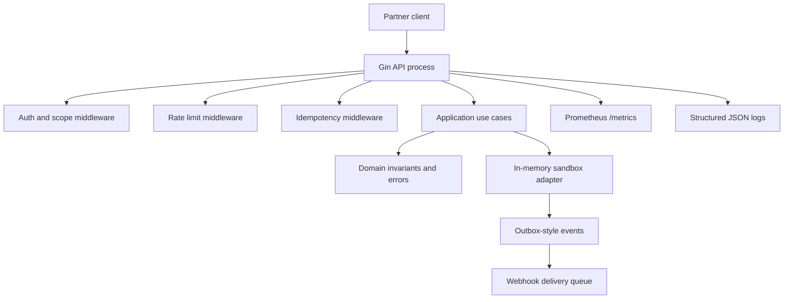

# C4 Container

```mermaid
flowchart TB
  Partner["Partner client"] --> API["Gin API process"]
  API --> Auth["Auth and scope middleware"]
  API --> RateLimit["Rate limit middleware"]
  API --> Idempotency["Idempotency middleware"]
  API --> UseCases["Application use cases"]
  UseCases --> Domain["Domain invariants and errors"]
  UseCases --> Store["In-memory sandbox adapter"]
  Store --> Events["Outbox-style events"]
  Events --> Webhooks["Webhook delivery queue"]
  API --> Metrics["Prometheus /metrics"]
  API --> Logs["Structured JSON logs"]
```

Production adapters will replace the in-memory store with PostgreSQL and Redis
behind the same application ports without changing the public route handlers or
OpenAPI contract.
