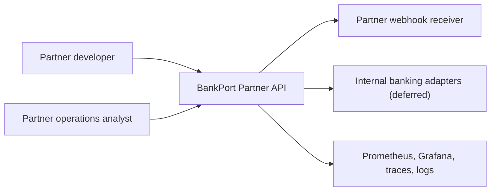

# C4 Context

BankPort is the public boundary between external partners and internal financial
systems. The current implementation keeps provider adapters fake while making
the public API controls concrete and testable.
