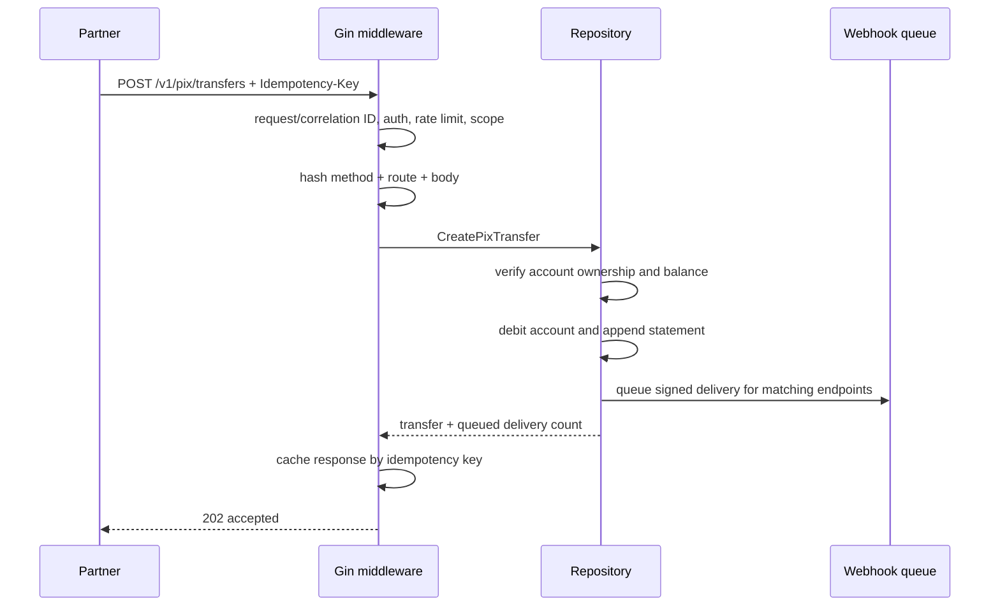
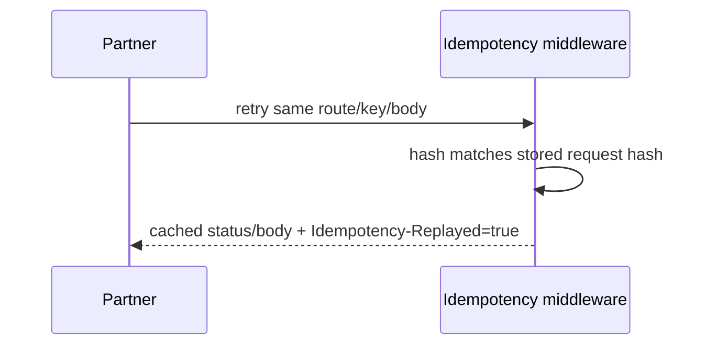

# Sequence Diagrams

## Idempotent Pix transfer

```mermaid
sequenceDiagram
  participant P as Partner
  participant G as Gin middleware
  participant R as Repository
  participant W as Webhook queue
  P->>G: POST /v1/pix/transfers + Idempotency-Key
  G->>G: request/correlation ID, auth, rate limit, scope
  G->>G: hash method + route + body
  G->>R: CreatePixTransfer
  R->>R: verify account ownership and balance
  R->>R: debit account and append statement
  R->>W: queue signed delivery for matching endpoints
  R-->>G: transfer + queued delivery count
  G->>G: cache response by idempotency key
  G-->>P: 202 accepted
```

## Idempotency replay

```mermaid
sequenceDiagram
  participant P as Partner
  participant I as Idempotency middleware
  P->>I: retry same route/key/body
  I->>I: hash matches stored request hash
  I-->>P: cached status/body + Idempotency-Replayed=true
```
