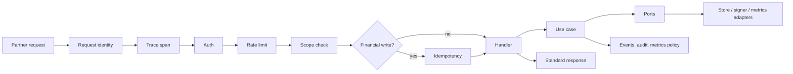

# Request Flow Diagram

```mermaid
flowchart LR
  A["Partner request"] --> B["Request identity"]
  B --> C["Trace span"]
  C --> D["Auth"]
  D --> E["Rate limit"]
  E --> F["Scope check"]
  F --> G{"Financial write?"}
  G -- yes --> H["Idempotency"]
  G -- no --> I["Handler"]
  H --> I
  I --> J["Use case"]
  J --> K["Ports"]
  K --> M["Store / signer / metrics adapters"]
  J --> N["Events, audit, metrics policy"]
  I --> L["Standard response"]
```
